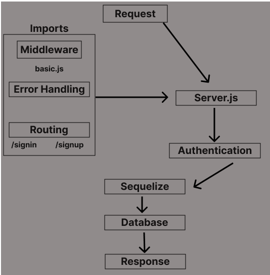

# basic-auth (LAB 06)

## Project: Auth Template

### Author: Tyler Bennett

### Problem Domain  

Basic Authentication template.

### Links and Resources

- [ci/cd](https://github.com/tyler-bennett52/basic-auth/actions/) (GitHub Actions)
- [back-end server url](https://basic-auth-0r65.onrender.com) (when applicable)

### Setup

#### `.env` requirements (where applicable)

DATABASE_URL requires a postgres DB url

#### How to initialize/run your application (where applicable)

- `node index.js`

#### How to use your library (where applicable)

#### Features / Routes

Authentication System Phase 1: Deploy an Express server that implements Basic Authentication, with signup and signin capabilities, using a Postgres database for storage.

#### Tests

fill this in as you see fit

- How do you run tests? npm test
- Any tests of note? no
- Describe any tests that you did not complete, skipped, etc.

#### UML

#### Attribution

I used the live demo code thinking that was the starter code. I see now there is actual starter code and there are some slight differences but I am in too deep to go back now.
